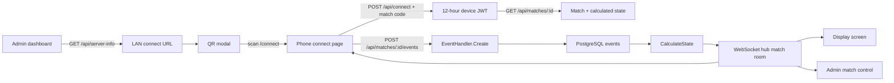

# Scoreboard Display: System Graph and Reliability Plan

Generated after inspecting the Go backend, React frontend, Docker/Nginx setup,
and the Graphify knowledge graph.

## Generated Graph Artifacts

- `graphify-out/graph.json`: 536 nodes and 1,194 edges.
- `graphify-out/GRAPH_TREE.html`: interactive collapsible project tree.

Open the tree locally:

```bash
open graphify-out/GRAPH_TREE.html
```

## Current Connection Flow



Graphify confirms that both `Connect.tsx` and `Display.tsx` depend on the same
`scoreboardWS` singleton in `frontend/src/services/websocket.ts`. This shared
connection is the central point for live score delivery and several current
failure modes.

## Confirmed Problems

### P0: WebSocket stays connected to the wrong room

Evidence:

- `frontend/src/services/websocket.ts:15-23` changes `currentUrl`, but `_connect`
  immediately returns when the existing socket is already open.
- `frontend/src/hooks/useWebSocket.ts:33-40` removes only the message listener.
  It does not disconnect or release the socket.

Impact:

- Moving from Dashboard (`/ws/global`) to Match Control
  (`/ws/match/:id`) can leave the browser on the global or previous match URL.
- Live score updates appear only after a manual page refresh.
- Reusing the singleton from another screen can replace the status callback.

Fix:

- Make the WebSocket service connection-aware and reference-counted, or create
  one socket instance per subscription scope.
- If `connect(url)` receives a different URL, close the old socket and connect
  to the new URL.
- Cancel stale reconnect timers and ignore close events from superseded sockets.
- Add subscribe/unsubscribe lifecycle tests.

### P0: Phone API and WebSocket URLs use localhost in Docker development

Evidence:

- `docker-compose.dev.yml:32-33` builds the browser with
  `http://localhost:8080/api` and `ws://localhost:8080`.

Impact:

- On a smartphone, `localhost` points to the smartphone itself.
- QR opens the frontend, but pairing, match fetches, score actions, and the
  WebSocket fail with connection errors.

Fix:

- Use same-origin `/api` and `/ws` from every browser.
- Let Vite proxy them during development and Nginx proxy them in production.
- Do not compile a machine-specific hostname into frontend assets.

### P0: Generated QR URL is wrong in production

Evidence:

- `backend/internal/handlers/device.go:22-33` hard-codes frontend port `3000`.
- `backend/internal/handlers/device.go:83-90` always returns
  `http://<ip>:3000/connect`.
- Production publishes Nginx on `${HTTP_PORT:-80}` in
  `docker-compose.yml:67-71`.

Impact:

- Production QR codes point to a port where no frontend is listening.
- HTTPS deployments are downgraded to HTTP.
- Custom hostnames, reverse proxies, and non-default ports are ignored.

Fix:

- Derive the public origin from trusted forwarded headers or a configured
  `PUBLIC_BASE_URL`.
- Prefer the current browser origin when the admin generates the QR.
- Include the match code in the QR:
  `/connect?code=<match_code>`.

### P0: The authoritative timer is not implemented

Evidence:

- `backend/internal/services/match_service.go:64-69` resets timer seconds to
  zero on start, pause, and end.
- `backend/internal/models/models.go:156-208` calculates running state but never
  calculates elapsed seconds.
- `timer_started_at` exists but is never written.
- `frontend/src/pages/Display.tsx:715-716` renders server timer seconds without
  a local tick.
- `frontend/src/pages/Connect.tsx:69-96` ticks locally, but every refresh or
  WebSocket event resets it to the server value, currently zero.

Impact:

- Display timer remains `00:00`.
- Phone timer jumps backward when a score event arrives.
- Different clients show different times.
- Restarting the backend loses in-progress timing.

Fix:

- Store accumulated seconds plus `timer_started_at`.
- On read/broadcast, calculate:
  `accumulated_seconds + now - timer_started_at` when running.
- On pause/timeout/end, atomically persist elapsed seconds and clear
  `timer_started_at`.
- Clients interpolate between server snapshots and periodically resync.

### P1: Admin status changes are ignored by live clients

Evidence:

- Backend broadcasts `status_change` in
  `backend/internal/services/match_service.go:163-181`.
- `status_change` is absent from `frontend/src/types/index.ts:62-74`.
- It is not handled in `frontend/src/hooks/useWebSocket.ts:53-90` or
  `frontend/src/pages/Display.tsx:113-176`.

Impact:

- Cancelling, pausing, or manually completing a match does not update open
  displays and controls until refresh.

Fix:

- Add `status_change` to the shared event contract and handle it exactly like a
  state snapshot.
- Prefer a single `match_state` WebSocket message shape for every mutation.

### P1: Event input is not validated

Evidence:

- `backend/internal/handlers/event.go:58-64` accepts any event type and payload.
- `CalculateState` treats any team other than `"A"` as team B.
- Negative or extremely large points are accepted.
- Events can be posted before start, after completion, or after cancellation.

Impact:

- Malformed requests can corrupt scores and state.
- A negative `score_remove` can add points.
- A connected scorer can continue changing a finished match by calling the API
  directly.

Fix:

- Use typed validators per event.
- Allow only known event types, teams A/B, and permitted point ranges.
- Enforce valid state transitions on the server.
- Return 400/409 for invalid actions, not 500.

### P1: Device authorization is incomplete

Evidence:

- Event posting checks the device token match in
  `backend/internal/handlers/event.go:35-43`.
- Match reads and player/event lists do not apply the same match restriction.
- `backend/internal/handlers/websocket.go:61-64` prefers the URL match ID over
  the match ID embedded in a device token.

Impact:

- A device token can read or subscribe to another match if its UUID is known.

Fix:

- Add middleware that requires `token.match_id == route.match_id` for device
  tokens on all match-specific REST and WebSocket routes.
- Reject device tokens on `/ws/global`.
- Keep admin/display access rules explicit.

### P1: Event persistence and side effects are not transactional

Evidence:

- `RecordEvent` inserts the event first, then updates the match row.
- If the side effect fails, the API returns an error but the event remains.
- A client retry can create a duplicate score event.

Fix:

- Execute event insert and match side effects in one database transaction.
- Add a client-generated idempotency key with a unique database constraint.
- Broadcast only after commit.

### P2: QR scan does not actually select the match

Evidence:

- `frontend/src/components/admin/MatchQRModal.tsx:19-20` encodes only `/connect`.
- `frontend/src/pages/Connect.tsx:370-400` does not read a query-string code.

Impact:

- Scanning the QR still requires typing the four-digit code.
- The QR feels broken even when networking works.

Fix:

- Encode `/connect?code=<match_code>`.
- Read, validate, and auto-submit the code once.
- Persist the device session in `sessionStorage` so accidental refresh can
  restore the scorer panel while the token remains valid.

### P2: Display access conflicts with the documented behavior

Evidence:

- `frontend/src/App.tsx:106-120` redirects unauthenticated `/display` users to
  login.
- The README describes `/display` as a directly openable TV/projector screen.

Fix:

- Decide one supported model:
  - Create a read-only display pairing token, or
  - Make only the minimum display snapshot and WebSocket feed public.
- Never require an administrator token to remain stored on a public TV.

## Additional Risks

- HTTPS display WebSocket URL is malformed in
  `frontend/src/pages/Display.tsx:21-22`; the HTTPS branch returns only
  `wss://` without the host.
- Local IP discovery returns the first active IPv4 address. Docker, VPN, or
  virtual interfaces may be selected instead of Wi-Fi/Ethernet.
- `CheckOrigin` accepts every WebSocket origin.
- CORS configuration is loaded but ignored; the server always allows `*`.
- WebSocket payload parse failures and initial phone refresh failures are
  silently swallowed, making diagnosis difficult.
- The WebSocket hub drops messages when a client buffer is full without
  recording a metric or forcing a snapshot resync.
- Match codes have only 9,000 possible values and do not expire or rotate.
- Device JWTs cannot be revoked before their 12-hour expiry.
- Nginx applies the same API rate limit to score buttons and ordinary reads;
  bursts from multiple scorer devices may produce 503 responses.
- The display layout write runs in a goroutine and ignores database errors.
- Backend and frontend currently have no automated tests for the critical
  scoring, timer, QR, or reconnect workflows.

## Implementation Plan

### Phase 1: Restore reliable live scores

1. Replace the WebSocket singleton lifecycle with URL-aware connections.
2. Add `status_change` support and a common state-snapshot handler.
3. Add reconnect resync: after every successful reconnect, fetch the latest
   match snapshot before accepting more local interaction.
4. Show an actionable offline banner and disable score buttons while the REST
   API is unreachable.

Acceptance:

- Scores update on display, phone, Dashboard, and Match Control without refresh.
- Navigating between two matches never leaks updates from the previous room.
- Killing and restarting the backend automatically reconnects and resyncs.

### Phase 2: Make QR and LAN access dependable

1. Use same-origin `/api` and `/ws` in development and production.
2. Add `PUBLIC_BASE_URL` with forwarded-header fallback.
3. Generate `/connect?code=<code>` QR URLs.
4. Auto-pair from the QR code and restore valid phone sessions after refresh.
5. Add a network diagnostics endpoint/page showing resolved public URL, API
   reachability, WebSocket reachability, and current client IP.

Acceptance:

- A phone on the same LAN can scan once and immediately see the scorer panel.
- Development, production port 80, custom ports, and HTTPS all work.

### Phase 3: Make state authoritative and safe

1. Implement server-authoritative timer calculations.
2. Validate every event and match state transition.
3. Add transactions and idempotency keys.
4. Enforce device-to-match authorization on REST and WebSocket routes.
5. Add match-code expiry/rotation and device-session revocation.

Acceptance:

- All clients show timer values within one second of each other.
- Duplicate taps/retries produce one event.
- Invalid or stale actions return clear 4xx responses and never change state.

### Phase 4: Tests and operations

1. Go unit tests for state calculation, event validation, authorization, timer
   pause/resume, undo/redo, and idempotency.
2. Go integration test for event commit plus WebSocket broadcast.
3. Frontend tests for socket URL switching, reconnect, QR auto-connect, and
   session restoration.
4. End-to-end test with admin, phone scorer, and display browser contexts.
5. Add structured logs and metrics for WebSocket connects, reconnects, dropped
   messages, event failures, and snapshot resyncs.

## Ready-to-Use Implementation Prompt

```text
Implement the Scoreboard Display reliability plan in
docs/SCOREBOARD_RELIABILITY_PLAN.md.

Prioritize the work in this order:
1. Fix WebSocket room switching and cleanup so Dashboard, Match Control,
   Display, and Connect always subscribe to the intended URL. Reconnect on URL
   changes, cancel stale retries, and resync the current match after reconnect.
2. Add status_change to the frontend event contract and update all live views
   from one normalized match-state snapshot handler.
3. Remove browser-facing localhost API/WS URLs. Use same-origin /api and /ws,
   with Vite and Nginx proxies. Generate public QR origins from PUBLIC_BASE_URL
   or trusted forwarded headers.
4. Change QR values to /connect?code=<match_code>, auto-connect exactly once,
   and restore an unexpired device token/session after refresh.
5. Implement an authoritative server timer using accumulated timer_seconds and
   timer_started_at. Persist elapsed time atomically on pause, timeout, match
   end, and restart; clients may interpolate but must resync.
6. Validate event type, payload, team, point range, and state transitions.
   Reject scoring before start and after completion/cancellation.
7. Make event creation plus side effects transactional and idempotent. Broadcast
   only after commit.
8. Enforce device token match scope on every match REST route and WebSocket
   room. Reject device tokens from global subscriptions.
9. Fix HTTPS WebSocket URL construction, configurable CORS/origin checks,
   silent error handling, and dropped-message resync behavior.
10. Add focused Go, frontend, and end-to-end tests for every acceptance
    criterion in the plan.

Preserve the existing Go/Gin/PostgreSQL and React/Vite/Zustand architecture.
Do not add polling as the primary live-update mechanism. REST snapshots are for
initial load and reconnect recovery; WebSocket snapshots drive normal live
updates. Keep UI behavior responsive on phones and display screens, and return
clear user-facing errors for offline, expired, forbidden, and invalid-state
conditions.
```

